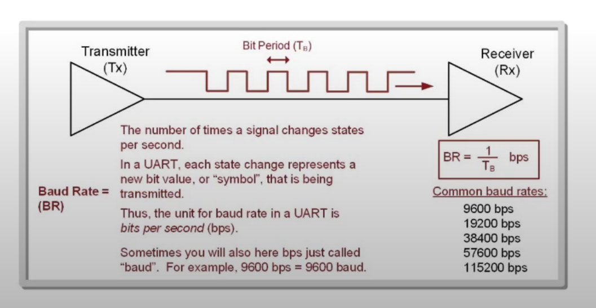
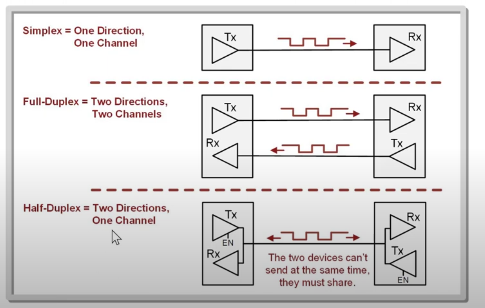
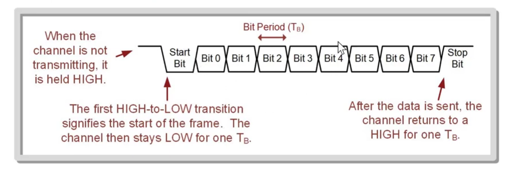
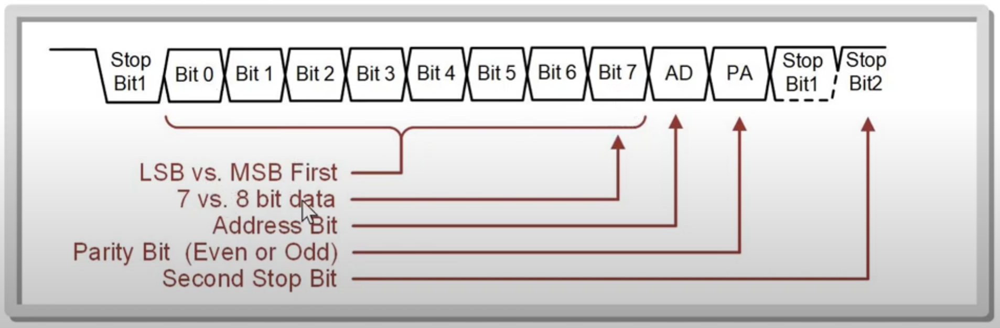
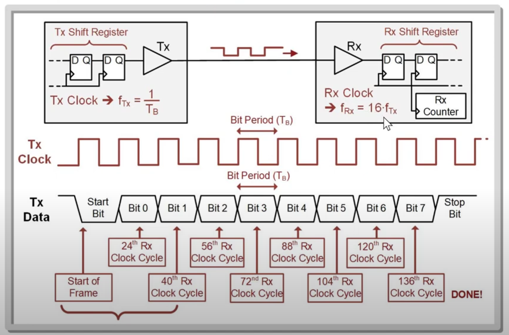
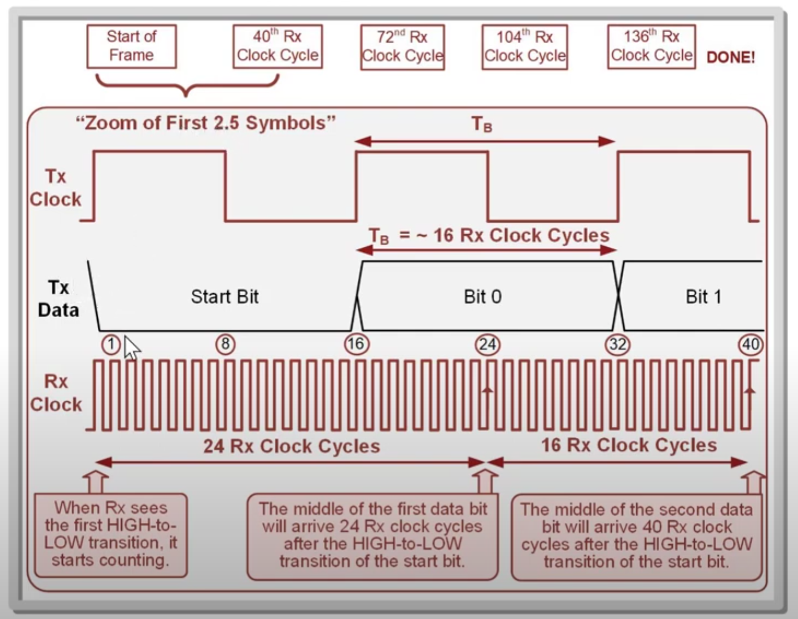

# The UART Standard

- Universal asynchronous receiver/transmitter - an approach to serial communication between two devices in which neither device shares a common clock.
- Each device only uses lines for data.
- Has a predefined protocol for how data is framed, how data packets start and stop, and how the receiver oversamples the incoming data to recover the information sent.
- Common baud rates being: 9600, 19200, 38400, 57600, 115200.

## More on Baud Rate

- Baud rate (BR) is the common data rate between Tx and Rx; the fastest rate at which the data line changes states.
- Baud rate for most applications is equivalent to bit rate, bits per second (bps).
- The bit period T$_B$ is the amount of time the data is on the line.
- The baud rate and a bit period (T$_B$) are related by BR = 1/T$_B$ .
- Baud rate must be set manually in both the Tx and Rx prior to data transmission (typical ranges is 9600 to 115200 baud).

## Link Types

- A link is when two devices are connected together to transfer information.

There are three types of links:
1. Simplex - Unidirectional. 1 wire/ channel, 1 direction.
2. Full-Duplex = 2 wires / channels two directions. For example 1 wire / channel will be Tx, and the other wire / Channel will be used for Rx.
3. Half-Duplex = 2 directions, 1 channel. For example there will be one wire that is bidirectional. The single wire / channel will be used for both Tx and Rx. The con of this set up is that the wire can only be used for either Tx or Rx at any given moment. Tx and Rx can not be used at the same time.

## Framing

Framing is used to describe how the bits are arranged in the UART serial bit sequence.

- When the channel is not transmitting, it is held HIGH.
- The first HIGH-to-LOW transition signifies the start of the frame. The channel then stays LOW for one T$_B$ .
- After the data is sent, the channel returns to a HIGH for one T$_B$ .
- Start bit is the initial symbol
- The start data transmission, the Tx drives the line LOW and holds it there for one T$_B$ .
- Typically, is UART the LSB is sent first however that can be changed to send the MSB first. LSB is the least significant bit and MSB is most significant bit.
- The Tx and Rx must be set up in similar fashion to know how the data is coming in.
- After the data has been transmitted (the 0's and 1's) the stop bit is then pulled HIGH to signify end of transmission.

### Bit Framing Common Options

The most common options that are configurable at least for the MSP430 are swapping the order in which the bits are sent, changing the data size between 7-bits and 8-bits, adding on address bit (AD), adding a parity bit (PA) and adding a second stop bit.

- When using transmit address, two frames are sent, one for data and one for address.
- The AD bit signifies whether the next frame is the address or data.
- The AD bit signifies whether the next frame is the address or data.

### Parity bit

Parity bit (PA) is used to detect transmission errors.

- Even parity - the transmitter counts the number of 1's in the data word and if the count is odd, it asserts the parity bit.
- Odd parity - the transmitter counts the number of 1's in the data word and if the count is even, it asserts the parity bit.

## Oversampling

How does the receiver determine what logic is sent if it doesn't have a clock?

- Oversampling - using a receiver clock that is faster than the transmitter clock.

- The receiver clock will oversample 16 times the clock speed.
- So for each bit period the receiver will sample 16 times (16 clocks).
- For each bit period we will sample on half of the 16 (clocks) which would provide us a sample that is in the middle of the bit period which will provide us a good sample. This happens after the start bit. So for example 16 (start bit) + 8 will be 24. The 24th clock cycle on the receiver. Which will be in the middle of bit 0. And then after we sample every 16 clock cycles to get a sample in the middle of each bit period.

Sometimes there can be issues with this method because the Tx and Rx clock will be out of sync during long Tx and Rx transmission times.
So there needs to be a period of rest between transmitting and receiving.

That's why typically 8 bits is typically sent in a UART but sometimes 64 bits can be used.

## Communication Standard

Communication standard is when logic levels are assigned to the UART logic values.

- As standard allows separate devices to communicate because both the logic levels and packet structure are known.
- The term transistor-to-transistor logic (TTL) is used to describe a UART that transmits a HIGH as the power supply (VCC) of the devices and a LOW as the GND of the device.
- Example MSP430FR2355 Specifications: Uses +3.4v TTL
- In our example 3.4v is a logic HIGH and 0v will be a logic 0.
